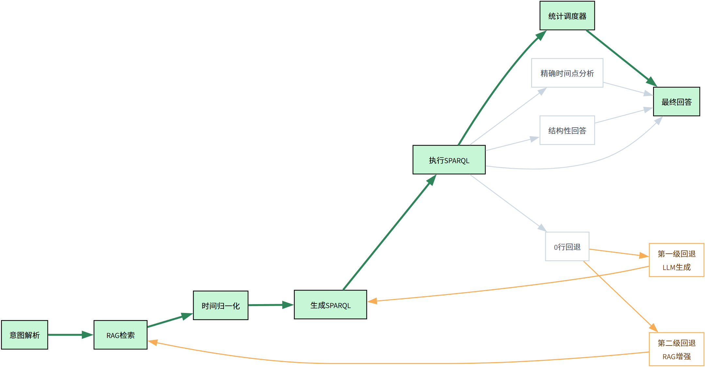
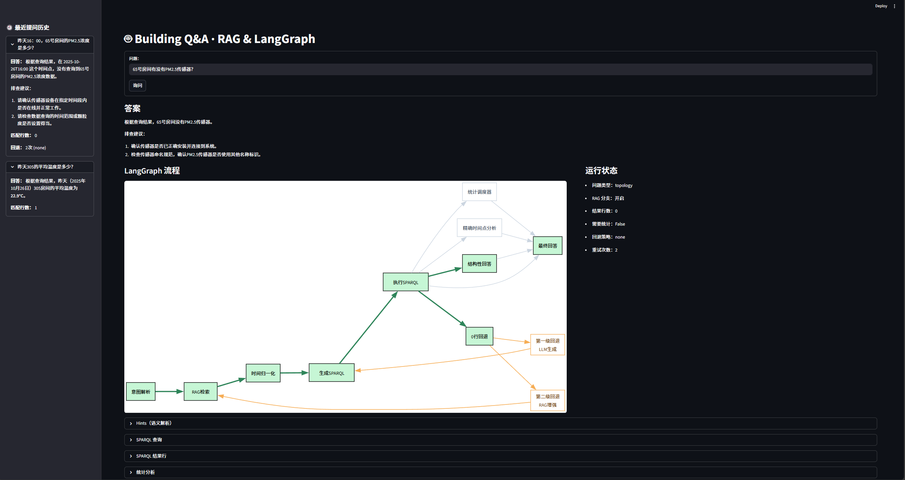

# RAG-LangGraph 楼宇问答系统：基于 Brick Schema 的智能查询与分析平台

## 一、项目概述

本项目构建了一个**基于 LangGraph 的多智能体系统**，支持使用自然语言查询建筑信息模型(BIM)和传感器数据。系统以 **Brick Schema** 为语义基础，结合 **RAG 检索增强生成** 与 **多级回退机制**，实现从自然语言到结构化查询再到数据分析的完整流程。

---

## 二、系统架构



---

## 三、核心模块

### 智能体节点
| 模块 | 功能描述 |
|------|----------|
| `nodes/rag_agent.py` | 语义解析 + FAISS向量检索，生成查询意图 |
| `nodes/normalize_time_agent.py` | 自然语言时间解析与归一化 |
| `nodes/sparql_agent.py` | SPARQL查询生成与多级回退机制 |
| `nodes/sparql_exec.py` | RDF图数据库查询执行 |
| `nodes/analysis_agent.py` | 时间序列数据分析（均值、极值、趋势） |
| `nodes/answer_agent.py` | 多语言答案生成与格式化 |

### 工作流管理
| 模块 | 功能描述 |
|------|----------|
| `graph.py` | LangGraph状态机定义与节点路由 |
| `web_app.py` | Streamlit Web界面与可视化流程展示 |

### 数据基础设施
| 模块 | 功能描述 |
|------|----------|
| `data_generator.py` | 生成符合Brick标准的测试数据 |
| `data_validate.py` | 数据质量验证与一致性检查 |

---

## 四、数据模型

### 知识图谱 (`data/topology.ttl`)
符合 Brick Schema 的建筑语义模型：
```turtle
@prefix brick: <https://brickschema.org/schema/Brick#> .
@prefix ref:   <https://brickschema.org/schema/Brick/ref#> .
@prefix bldg:  <urn:demo-building#> .

bldg:Room_001 a brick:Office ;
    brick:area [ brick:value 35.5 ; brick:hasUnit unit:M2 ] ;
    brick:hasPart bldg:Room_001_Temp, bldg:Room_001_RH, bldg:Room_001_Lux .

bldg:Room_001_Temp a brick:Air_Temperature_Sensor ;
    brick:isPointOf bldg:Room_001 ;
    ref:hasTimeseriesReference [
        ref:hasTimeseriesId "room_001.temp"
    ] .
```

### 时序数据 (`data/timeseries.csv`)
多传感器时间序列数据：
```
ts_id,timestamp,value,unit
room_001.temp,2025-10-20T00:00:00+08:00,23.15,DEG_C
room_001.rh,2025-10-20T00:00:00+08:00,52.39,PERCENT_RH
room_001.lux,2025-10-20T00:00:00+08:00,27.84,LUX
room_001.co2,2025-10-20T00:00:00+08:00,450.2,PPM
```

---

## 五、功能特性

### 🎯 智能语义理解
- **多意图识别**: 时序查询、拓扑分析、存在性检查
- **时间表达式解析**: "昨天"、"最近6小时"、"2025-10-20"等
- **多语言支持**: 中英文自然语言理解

### 🔄 多级回退机制
1. **初始查询**: 基于规则的SPARQL模板生成
2. **第一级回退**: LLM直接生成SPARQL查询
3. **第二级回退**: RAG增强的查询生成

### 📊 丰富的数据分析
- **基础统计**: 平均值、最大值、最小值
- **趋势分析**: 线性回归趋势判断
- **精确时间点**: 特定时刻数据查询
- **拓扑推理**: 房间数量、传感器分布分析

### 🎨 可视化交互
- **实时流程追踪**: LangGraph执行过程可视化
- **执行状态监控**: 节点执行时间、回退策略展示
- **历史记录**: 会话内查询历史管理

---

## 六、快速开始

### 环境准备
```bash
# 安装依赖
pip install -r requirements.txt

# 设置API密钥
export DEEPSEEK_API_KEY="your-api-key-here"
```

### 数据生成与验证
```bash
# 生成测试数据（500个房间，7天数据）
python data_generator.py --num-rooms 500 --days-back 7

# 验证数据质量
python data_validate.py
```

### 启动系统
```bash
# 启动Web界面
streamlit run web_app.py
```

### 示例查询
- **时序分析**: "305房间昨天平均温度是多少？趋势如何？"
- **拓扑查询**: "整栋楼有多少个房间？哪些房间有PM2.5传感器？"
- **存在性检查**: "1208房间有没有二氧化碳传感器？"
- **精确时间**: "10月20号14点305房间的温度是多少？"

---

## 七、技术栈

- **框架**: LangGraph, Streamlit
- **LLM**: DeepSeek API
- **知识图谱**: RDFLib, Brick Schema
- **向量检索**: FAISS, Sentence Transformers
- **数据分析**: Pandas, NumPy
- **可视化**: GraphViz, Streamlit Components

---

## 八、可视化界面
